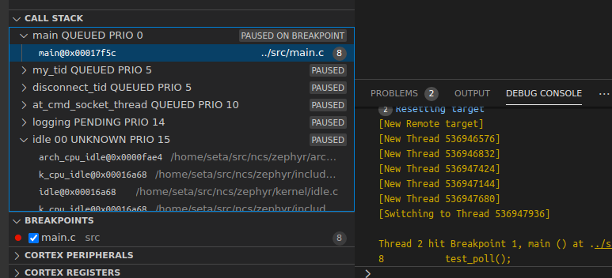

# Zephyr RTOS plugin for JlinkGDBserver

This plugins provides information of Zephyr RTOS threads for any
GDB aware UI that uses Jlink's GDBServer.

The work is developed on top of Seggers Jlink GDB Server SDK.

## License

The following files are directly coming from Segger SDK:

* `JLINKARM_Const.h`
* `RTOSPlugin.h`
* `TYPES.h`

See file [License.txt](JLinkGDBServer_RTOSPlugin_SDK_V120/License.txt) for Segger SDK license.

All other plugin files are licensed under Apache-2.0.

## Building

I have replaced the original Makefile based build rules with just a simple CMake
file.

To build the plugin on Linux & macOS:
```
mkdir build && cd build
cmake ..
cmake --build .
```

To build the plugin on Linux 32-bit, on 64-bit host (ensure multilib is installed):
```
mkdir build && cd build
cmake -DCMAKE_C_FLAGS=-m32 ..
cmake --build .
```

To build it on Windows, you will need Visual Studio 16 (2019):
```
mkdir build
cd build
cmake -A win32 ..
cmake --build .
```
Or you could skip the last command and load the `.sln` with Visual Studio and rebuild everything.

## Usage

First, the application must build with
```
CONFIG_DEBUG_THREAD_INFO=y
```
That is mandatory to make requires symbols visible in final elf file.

To see the Threads, you need to pass the plugin for JLinkGDBServer as a parameter
```
JLinkGDBServer -rtos <path to libzephyr_rtos.so>
```

## Using with west

If you start your debug session with Zephyr's west tool, you may add the plugin path to the command line:
```
west debug --tool-opt="-rtos GDBServer/RTOSPlugin_Zephyr"
```
By default, the plugin is installed in GDBServer directory under JLink's libraries. If the command above
does not work, or you are using a plugin build from these sources, you need to use absolute path,
shell characters like `~` might not work.

Note that because of of west python scrip wraps around the command, you need to escape the `\` character on Windows.
```
west debug --tool-opt="-rtos c:\\path\\to\\zephyr_rtos.dll"
```

## Using with Cortex-Debug plugin for VSCode



You can use the plugin with Cortex-Debug by defining following `launch.json`

```
{
	"version": "0.2.0",
	"configurations": [
		{
			"cwd": "${workspaceRoot}",
			"executable": "build/zephyr/zephyr.elf",
			"name": "Debug Microcontroller",
			"request": "launch",
			"type": "cortex-debug",
			"servertype": "jlink",
			"device": "nRF9160_xxAA",
			"armToolchainPath": "${env:HOME}/zephyr-sdk/arm-zephyr-eabi/bin",
			"toolchainPrefix": "arm-zephyr-eabi",
			"svdFile": "/home/user/SVD/nrf9160.svd",
			"serverArgs": ["-rtos", "/home/user/jlink-zephyr/build/libzephyr_rtos.so"]
		},
	]
}
```

## Using with macOS

On macOS, ``JLinkGDBServer`` is built with library validation options that require built plugins to be ``codesign``ed with the same Team ID as the executable.
By default this means that you cannot run plugins that you build yourself.
This can however be worked around by manually removing the signatures on ``JLinkGDBServer`` (After creating a backup of the original file).
```
sudo cp /Applications/SEGGER/JLink/JLinkGDBServer /Applications/SEGGER/JLink/JLinkGDBServer.backup
sudo codesign -f -s - /Applications/SEGGER/JLink/JLinkGDBServer
```
This will most likely break the usage of other plugins until the backup is restored.

## Known problems

* Starting up: This plugin does not reliably detect whether RTOS is already running, and may show garbage state. Safer to run to `main()` before stopping at all.
* Interrupts: In Cortex-M interrupts run from different stack, so they should be shown to GDB as a dummy thread. Hard-faulting thread is not easy to identify.
* Other Arm cores than Cortex-M33: This plugin has only been tested initially on nrf9160dk, and no work has been done to verify differences between Arm architectures on Zephyr.
* Other than Arm cores: Zero effort has been used to other architectures, and the plugin does not even check the core parameter, so it might probably crash or show garbage values.
* Distributing the built .DLL file in Windows requires user to install [Visual C++ Redistributable](https://support.microsoft.com/en-us/topic/the-latest-supported-visual-c-downloads-2647da03-1eea-4433-9aff-95f26a218cc0) on a target machine.


## Known problems in JLinkGDBServer

* When `RTOS_GetNumThreads()` returns zero, GDB server still calls `RTOS_GetThreadRegList()` with thread id zero and generates a new dummy thread for GDB. This breaks debugging of the board startup.
* There is no easy way to tell GDBServer that CPU is not yet running in Thread mode, and therefore
  plugin should be ignored.
